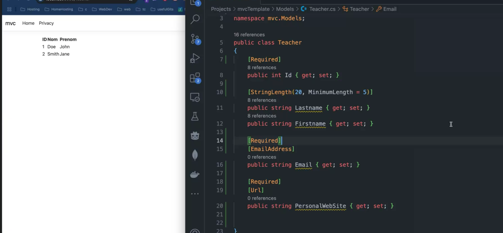
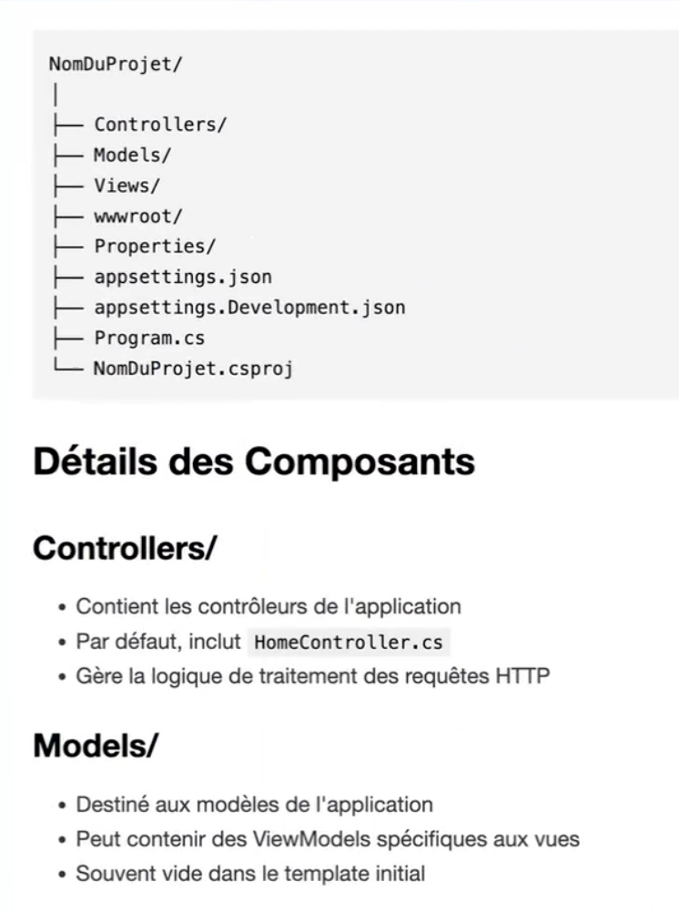
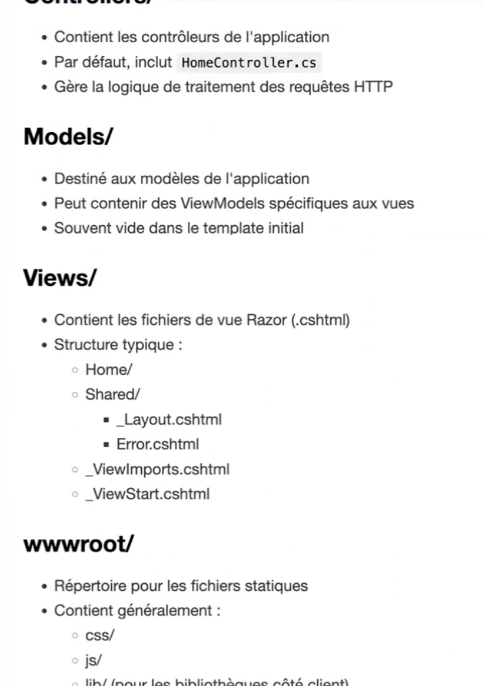
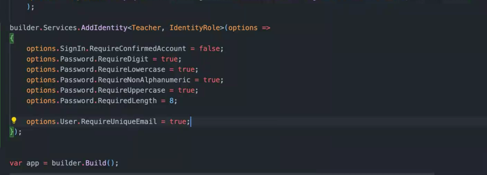
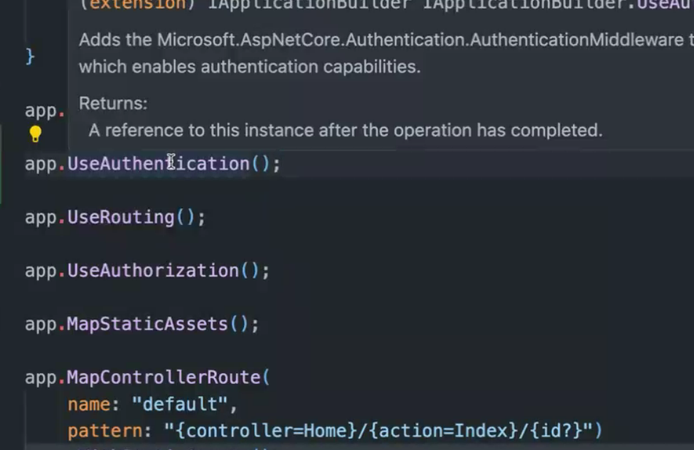

# .net-rabatel

## Prise de notes :

.net = environement windows
.net core = linux / macOS
csproj = package.json
namespace = conteneur qui permet d'organiser et de regrouper des classes et autres types de données liés pour les réutiliser dans un autre fichier ayant le même namespace.

La vue doit impérativement avoir le lmême nom que le méthode.

**Actions** = Methodes controlleurs !

### Ajout de conditions form :

Dans le class :

### Structure :

## Initier un nouveau projet :

- dotnet new list
- notnet new -n mvc - o mvcTemplate
- cd mvcProject
- dotnet run

## Connection a une DB :

- Sur nuget.org, installer ces packages à la racine du projet :
  - install : Microsoft.EntityFrameworkCore.Design
  - install : pomelo.ENtityFrameworkCore.MySql

**Authentification** : identity (package)

**viewModel** sert au contrôle du format des veleurs retourné par le formulaire.

## Créer une migraton de la db :

- dotnet ef migrations add initialMigration
- dotnet ef database update

## Auth :

- Installer les dependences :

  1. dotnet add package Microsoft.AspNetCore.Identity.EntityFrameworkCore --version 8.0.0
  2. dotnet add package Microsoft.AspNetCore.Identity.UI --version 8.0.0

- ApplicationDbContext.cs :

  1. Class ApplicationDbContext : IdentityDbContext<Student> {} --> la classe doit hérité de IdentityDbContext

- Program.cs :

- dotnet ef migrations add IdentitySetup
